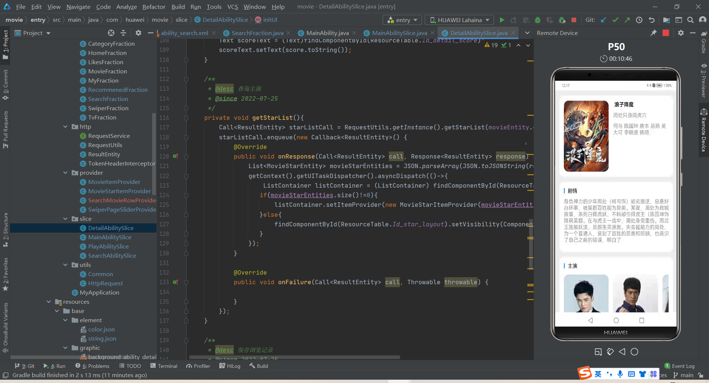
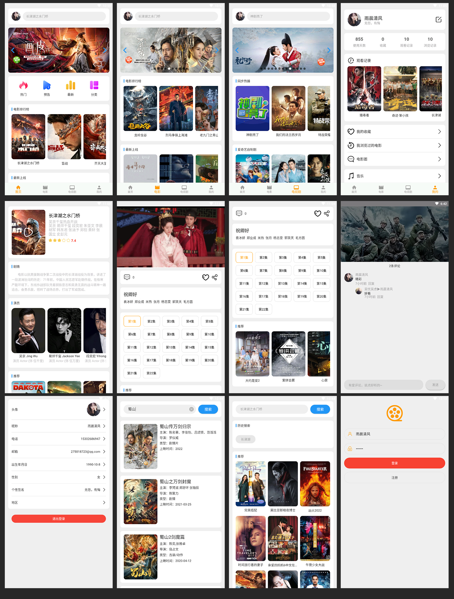
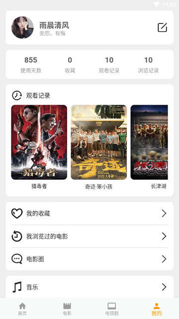

# Harmony鸿蒙电影APP

开发者：吴怨吴悔

由于鸿蒙官方停止了对java语言版本的维护，本项目也将停止更新，根据官方推荐使用arkTS语言开发

首次使用java语言编写的Harmony鸿蒙电影APP，有flutter、android、react-native、harmony四个版本的，正在努力开发中。。。

其他完整版本APP请查看个人主页

后端接口项目和sql语句：https://github.com/wuyuanwuhui99/springboot-app-service

flutter版本参见: https://github.com/wuyuanwuhui99/flutter-movie-app-ui

react native版本参见: https://github.com/wuyuanwuhui99/react-native-app-ui

vue在线音乐项目：https://github.com/wuyuanwuhui99/vue-music-app-ui

在线音乐后端项目：https://github.com/wuyuanwuhui99/koa2-music-app-service

vue3+ts明日头条项目：https://github.com/wuyuanwuhui99/vue3-ts-toutiao-app-ui